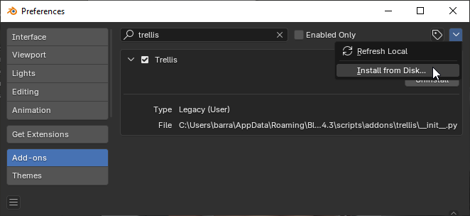
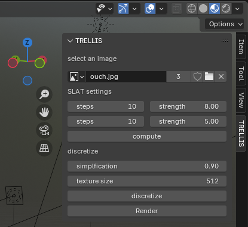
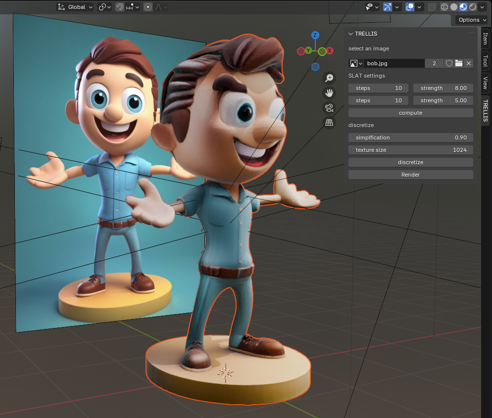
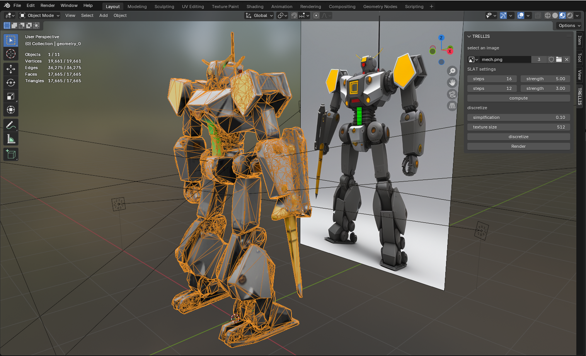

# TRELLIS for blender

addon to bind [TRELLIS](https://github.com/Microsoft/TRELLIS) to blender, it allows to compute 3D models from an image and display the result in Blender.

this is an experimental **toy project**, mostly to learn how to create a Blender add-on, it will not be maintained or updated in a foreseable future.

I'm taking some notes about the [inputs, results & limitations](#input_results_limitations) and writing some [dev notes](#notes) as I go.

## ⚠️ pre-requisite ⚠️

### You need to install and set up [TRELLIS](https://github.com/Microsoft/TRELLIS) locally.

this means you need a beefy GPU with **a minimum of 16Go VRAM**, CUDA 11.8+.


### roadmap & things
- [x] bind Blender to a TRELLIS service running locally
- [x] separate Gaussian Splatting generation from GLB discretization & optimization
- [x] use drag & drop image to create a mesh in place
- [x] tried <a href="https://github.com/Stability-AI/stable-fast-3d">SF3D</a> and <a href="https://github.com/Stability-AI/stable-point-aware-3d">SPAR3D</a> instead of TRELLIS: 
    - pros 
        - initial pose is more faithful to the source image 
        - nice "cubic" UVs trick that produces a human readble UV map
        - low-ish memory footprint ; it peaked at 12Go though discarding all the RTX 20XX series
        - tries to "unlight" the diffuse texture
        - very fast ( ~5s from image to model)
    - cons
        - produces a very crispy object, disjoint with lots of floaters
        - low quality discretization ; they use an intentionnaly low amount of particles 
        - poor novel view synthesis: the sides and the back of objects is notoriously mushy, often ending up as noise 
- [ ] improve the resulting mesh: the resulting meshes are disconnected patches, trying to imporve the toppology 
    - [x] tried Open3d's <a href="https://www.open3d.org/docs/release/tutorial/geometry/mesh.html#Connected-components">connected components</a> only to realize [how fragmented the regions were](https://bsky.app/profile/nicoptere.bsky.social/post/3lfq4r436222s)
        - [ ] TODO: add operator call to display the connected components
    - [x] tried <a href="https://github.com/SarahWeiii/CoACD/tree/main">Approximate Convex Decomposition for 3D Meshes with Collision-Aware Concavity and Tree Search</a> which produces <a kref="https://bsky.app/profile/nicoptere.bsky.social/post/3lfspmzwlzs2d">interesting results</a>, need to assign patches to hulls.
    - [ ] try <a href="https://github.com/rkjones4/SHRED">SHRED</a>
    - [ ] add <a href="https://paperswithcode.com/task/3d-semantic-segmentation">semantic segmentation</a> involves custom training sets and intermediate data formats.
- [ ] understand Blender scripting

TOOD 
- [ ] understand Blender scripting
- [ ] versioning the files to compare different generation settings
- [ ] iron out the naming to re-generate a mesh
- [ ] document results + screenrecordings


## installation

download or clone this repo "somewhere".

open Blender and install the add-on from the **edit > preferences > addons menu**, choose install from disk and select the **trellis.zip** file from "somewhere". 



then activate it if it doesn't start automatically. the panel should be available under the **'item', 'tool' 'view'** tools.



## usage

### start the server to compute TRELLIS files
for many reasons, the TRELLIS computations are handled in a separate terminal.
the server is located in the add-ons foolder, you can find the server here:

```python
import os
import addon_utils
path = addon_utils.paths()
path = [str for str in path if not '_core' in str ][0]
server_file = path + "/trellis/server/server.py"
# this should be the server file location
print( server_file )
```

run the server in a separate terminal, for instance on Windows:
```shell
python 'C:\Users\__USER__\AppData\Roaming\Blender Foundation\Blender\4.3\scripts\addons/trellis/server/server.py'
```
then start Blender and open `trellis.blend` or if blender is available from the CLI:
```shell
blender .\trellis.blend -y
```


in Blender, first, select an image from the image browser or drag drop an image file from your desktop or select an drag-dropped image. 

### compute the point cloud

then you can change the SLAT generation settings. they correspond to [these TRELLIS settings](https://github.com/microsoft/TRELLIS/blob/main/example.py#L23-L31). in doubt, leave them "as is".

hitting **compute** will call the SLAT generation, this step is fast and will produce a Gaussian Splatting model that gives a good idea of the final result.


the SLAT `*.ply` file is saved next to the source image and can be viewed in a Gaussian Splatting viewer. I'd recommend [the SuperSplat online editor ](https://playcanvas.com/supersplat/editor) ([repo](https://github.com/playcanvas/supersplat)) to see the difference with the Blender preview!

the second step is to discretize the Gaussian Splatting model, you can tweak the mesh **simplification ratio** and the model's **texture size**. higher simplification ratios compute much faster but produce 'blobby' results.

### discretize
hitting **discretize** will ... well ... discretize the Gaussian Splatting model and turn it into a triangular mesh. this step is slow, especially with low simplification ratios. it should produces something like this:


hitting discretize directly will run both the SLAT and the discretization steps.

### decimate
not sure if useful but the scripting layout of the blender file contains a decimate/triangulate modifier that can be ran to collapse coplanar faces. it works well on mechanical meshes.



# <a name="input_results_limitations">inputs, results, limitations</a>

* use large images: smaller images tend to be misinterpreted. 

* the models sees "objects" rather than "environments", the input image should be thought of in terms of "turntable" rather than "360° panoramas" or "landscapes".

* salient details can lead to misinterpretation of the scene depth and create artificial "planes".

* the most successful image represent a single, realistic subject, in whole ("from head to toes"), well lit with "sculptural" or "photographic" light. 

* model struggles with "shortcuts", frontal poses and T-poses work better for characters.

* scenes with effects like blur, bloom, DOF, bokehs, distance fog etc. will fail.

* thin details (like hairs, feathers, lines ... ) and natural effects (mist, lightnings, steam, water ripples etc.) get obliterated.

* the back of the meshes is [usually darker](https://github.com/microsoft/TRELLIS/issues/124) and tend to lose details, often ending up completely black. 

* 2D designs fail: line art, comics, pixel art, flat design etc. don't work, probably due to the lack of "3D" depth informations.

* mechanical objects work well if they're fully in the frame and show "as much as possible" of their inner details.

* the uvs are islands on an atlas, they're scattered without semantic understanding yet have a good connectity. 

* thanks to the UVs, the resulting meshes are **very resilient to aggressive decimation**.


# <a name="notes">dev notes, caveats, tips etc.</a>

* Blender runs its own Python version. a script / add-on is executed in the context of this Python environment. we can't install dependecies (pip) at runtime, anything else must run in separate Python installs/terminals on the system. an add-on can't run python script in separate terminals and comunication with servers is slow.

* it's impossible to set the properties of an object directly from a Panel ; any change must be performed by an operator. variables and references must be stored so that Operators can perform the changes. 

* storing is tedious (need a wrapper) but makes everything very responsive 
```python
from bpy.types import WindowManager, Image, Object
from bpy.props import FloatProperty, IntProperty, PointerProperty
# storing an int
WindowManager.sparse_steps = IntProperty(name="steps", default=12, min=1, max=100)
# storing a float
WindowManager.slat_strength = FloatProperty(name="strength", default=3, min=0, max=50, step=0.1)
# storing an object
WindowManager.gizmo = PointerProperty(name="gizmo", type=Object)
# storing an image object
WindowManager.image = PointerProperty(name="image", type=Image)
```

* accessing the `context` is still a mystery, need to dig further. an unavailable context blocks most operations.

* remote server calls block the execution, even when using async calls.
the workaround looks convoluted (modal & timers)

* list a `struct` object's properties: 
```python
for p in object.bl_rna.properties.items():
    print( p )
```

* server memory keeps inflating...

