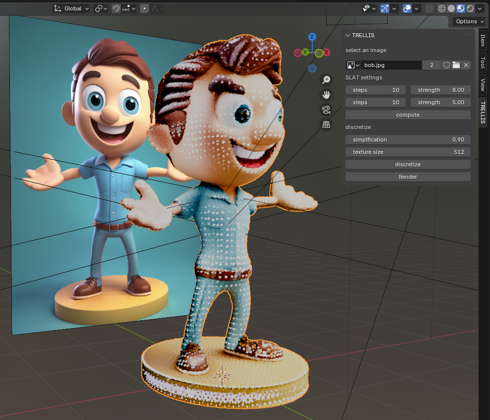

# TRELLIS for blender

addon to bind TRELLIS to blender, it allows to compute 3D models from an image and display the result in Blender.

## ⚠️ warning ⚠️

this is an experimental **toy project**, mostly to learn how to create a Blender add-on, it will not be maintained or updated in a foreseable future.

### You need to set up [TRELLIS](https://github.com/Microsoft/TRELLIS) on your computer.

this means you need a beefy GPU with a minimum of 16Go VRAM and CUDA installed.

## install

download or clone this repo "somewhere".

open Blender and install the add-on from the **edit > preferences > addons menu**, choose install from disk and select the **trellis.zip** file from "somewhere". 


then activate it if it doesn't start automatically. the panel should be available under the **'item', 'tool' 'view'** tools.


## usage

### start the server to compute TRELLIS files
for many reasons, the TRELLIS computations are handled in a separate terminal.
the server is located in the add-ons foolder, you can find the server here:

```python
import os
import addon_utils
path = addon_utils.paths()
path = [str for str in path if not '_core' in str ][0]
server_file = path + "/trellis/server/server.py"
# this should be the server file location
print( server_file )
```

run the server in a separate terminal, for instance on Windows:
```shell
python 'C:\Users\barra\AppData\Roaming\Blender Foundation\Blender\4.3\scripts\addons/trellis/server/server.py'
```
TODO : use async.io

TODO : UI panel button to start the server in a separate terminal?

### controls
first select an image, then you can change the SLAT generation settings. they correspond to [these TRELLIS settings](https://github.com/microsoft/TRELLIS/blob/main/example.py#L23-L31), or - in doubt - just leave them "as is".

hitting **compute** will call the SLAT generation, this step is fast and will produce a Gaussian Splatting model that gives a good idea of the final result.



the second step is to discretize the Gaussian Splatting model, you can tweak the mesh **simplification ratio** and the model's **texture size**. higher simplification ratios compute much faster but produce 'blobby' results.

hitting **discretize** will ... well ... discretize the Gaussian Splatting model and turn it into a triangular mesh. this step is slow, especially with low simplification ratios. it should produces something like this:


hitting discretize directly will run both the SLAT and the discretization steps.

post process:
not sure if useful but the scripting layout of the blender file contains a decimate/triangulate modifier that can be ran to collapse coplanar faces.

