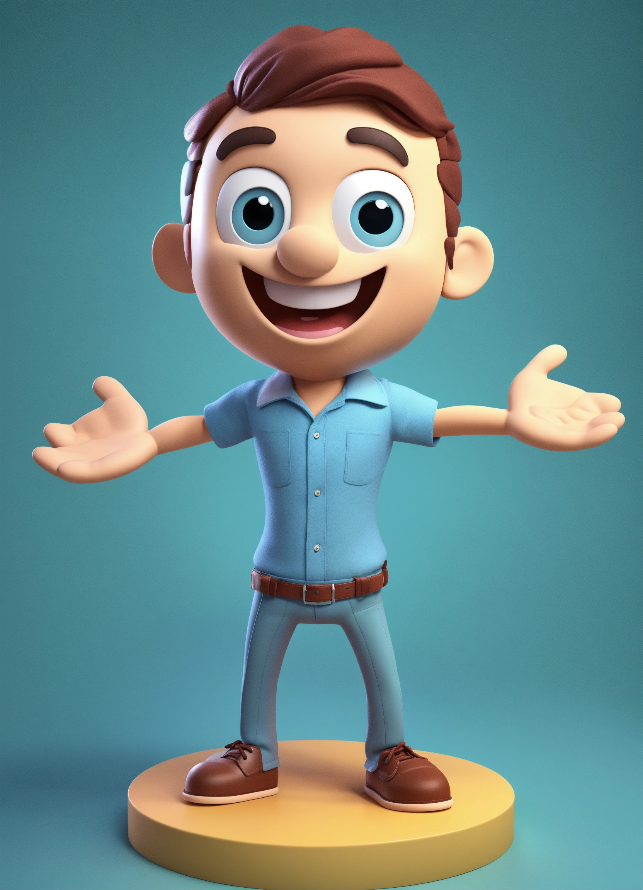
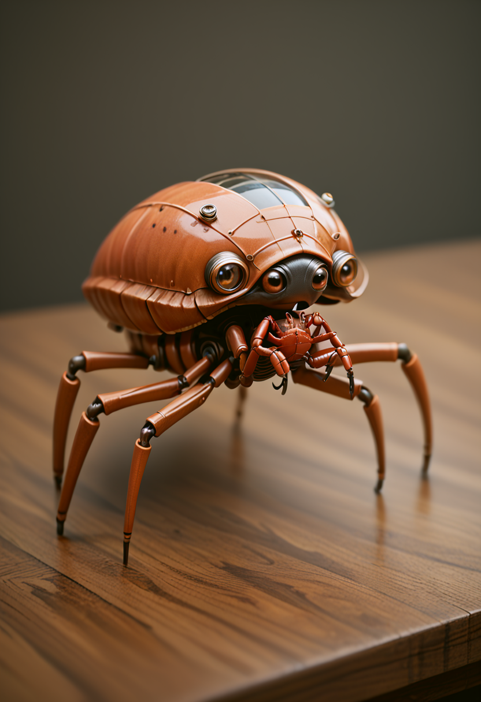
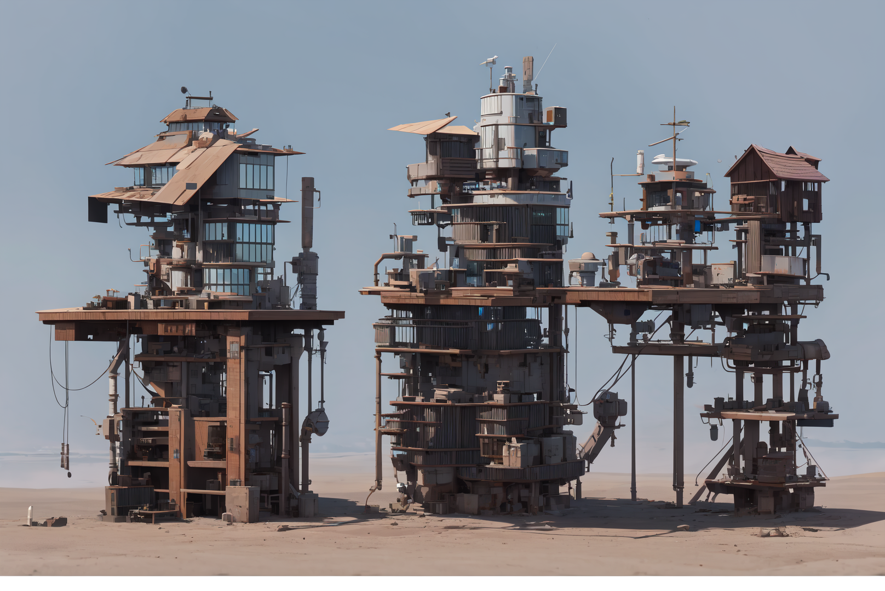
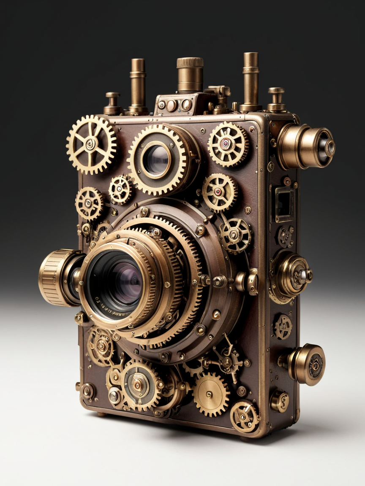
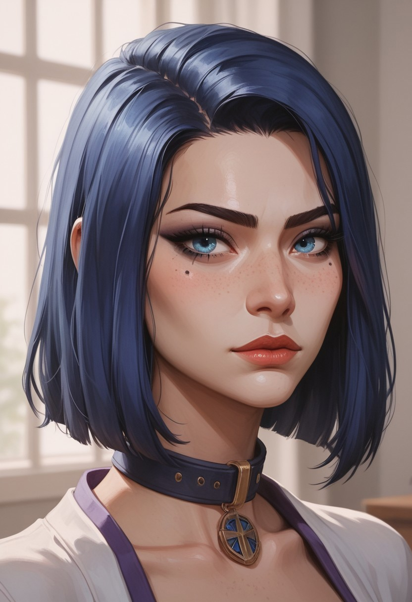
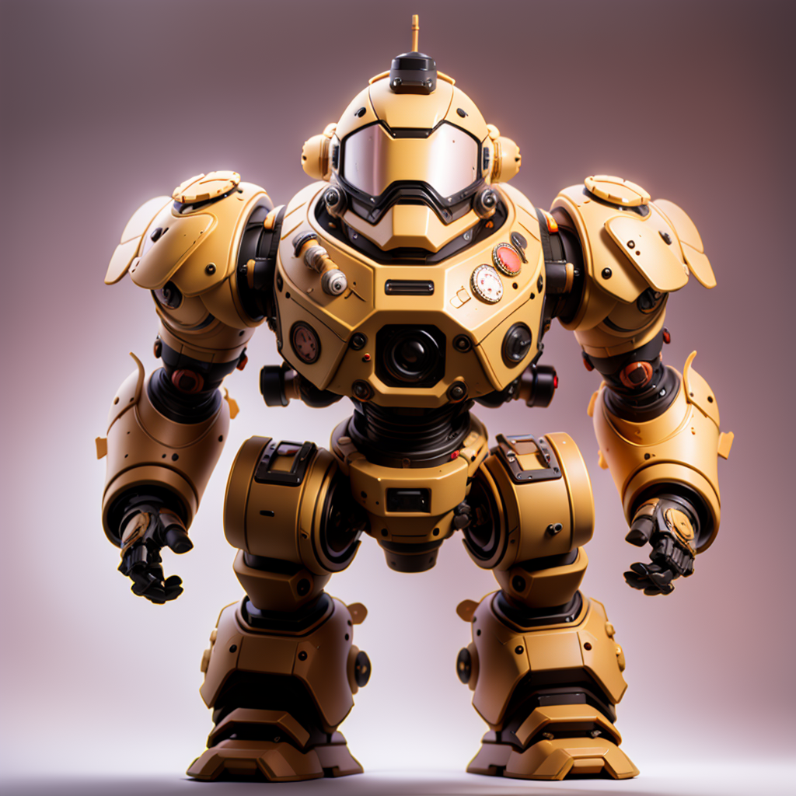
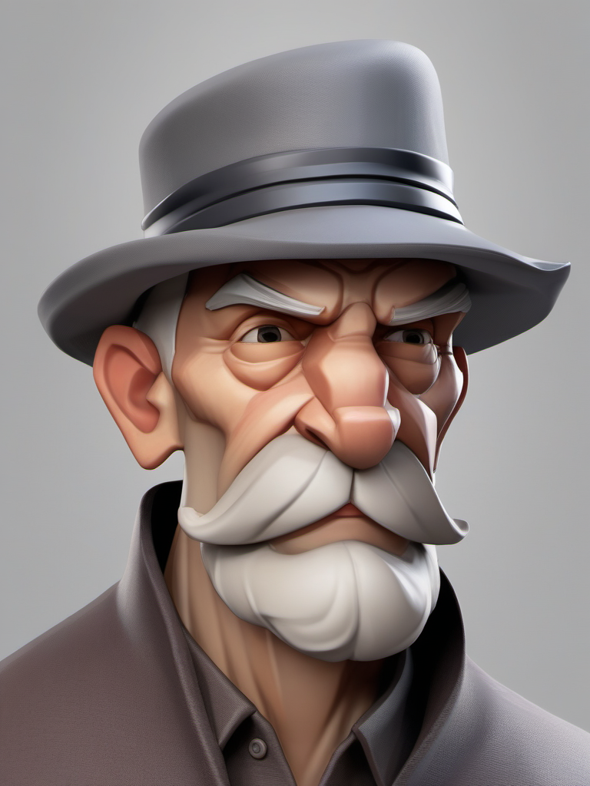
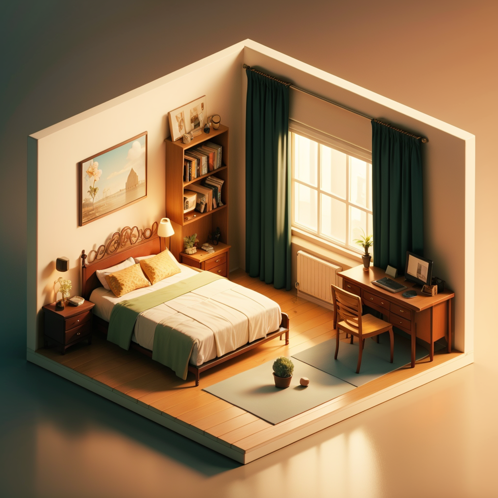

# sources
the images are collected from internet, often generated from T2I models.
I'll try to keep track of the exact references here, as of now, they mostly come from [civit.ai](https://civit.ai/) and [lexica](https://lexica.art/)

|images|||
|-|:-:|-:|
| | | |
| | | |
| | | |
| | |||
