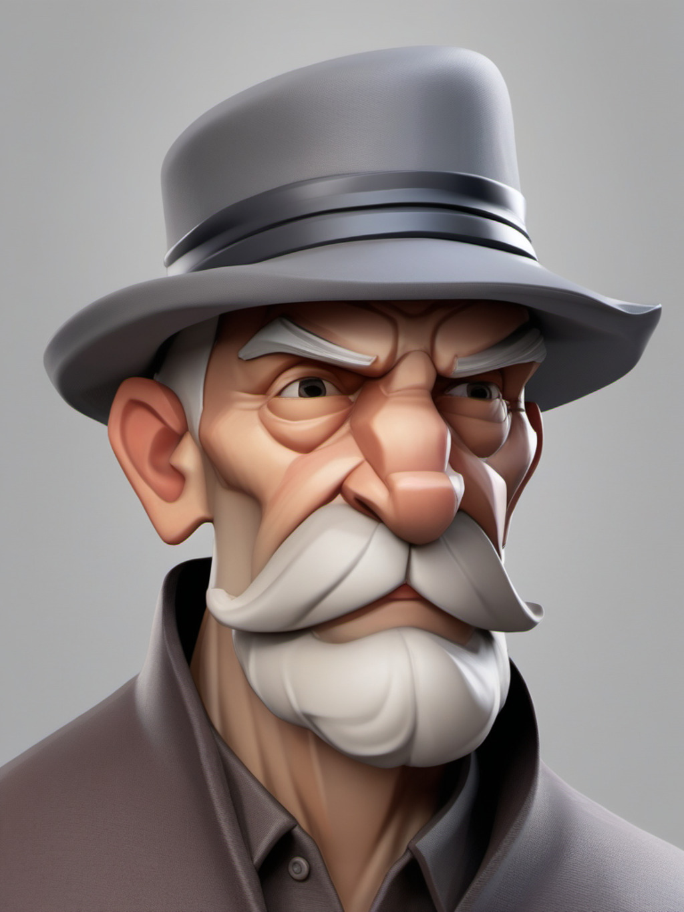
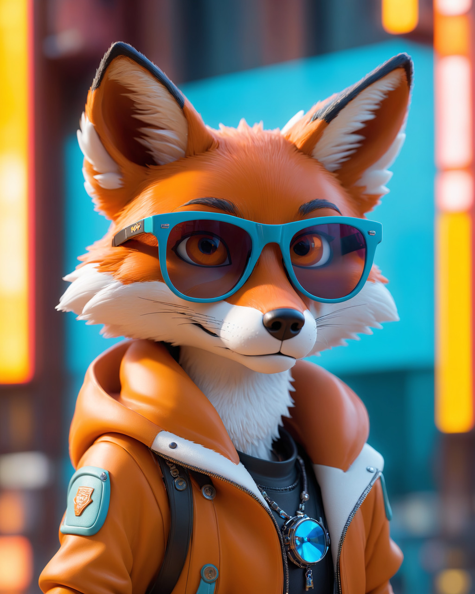
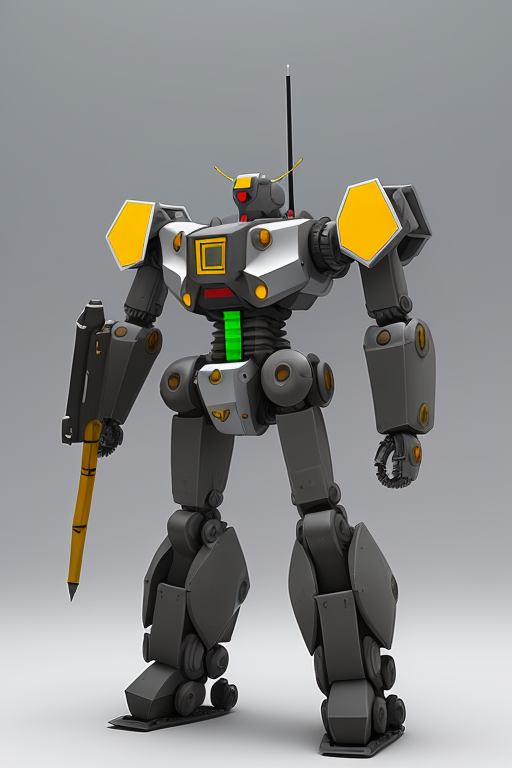
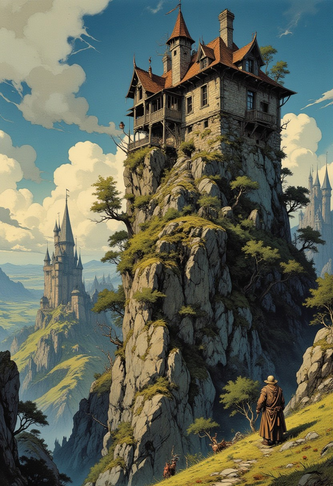
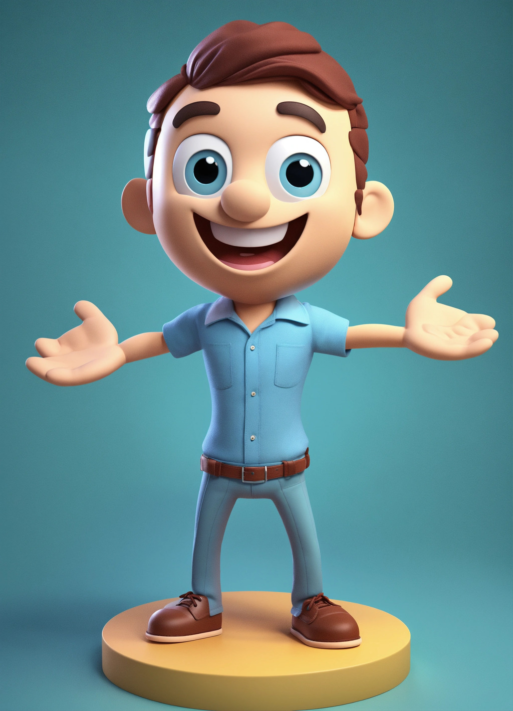
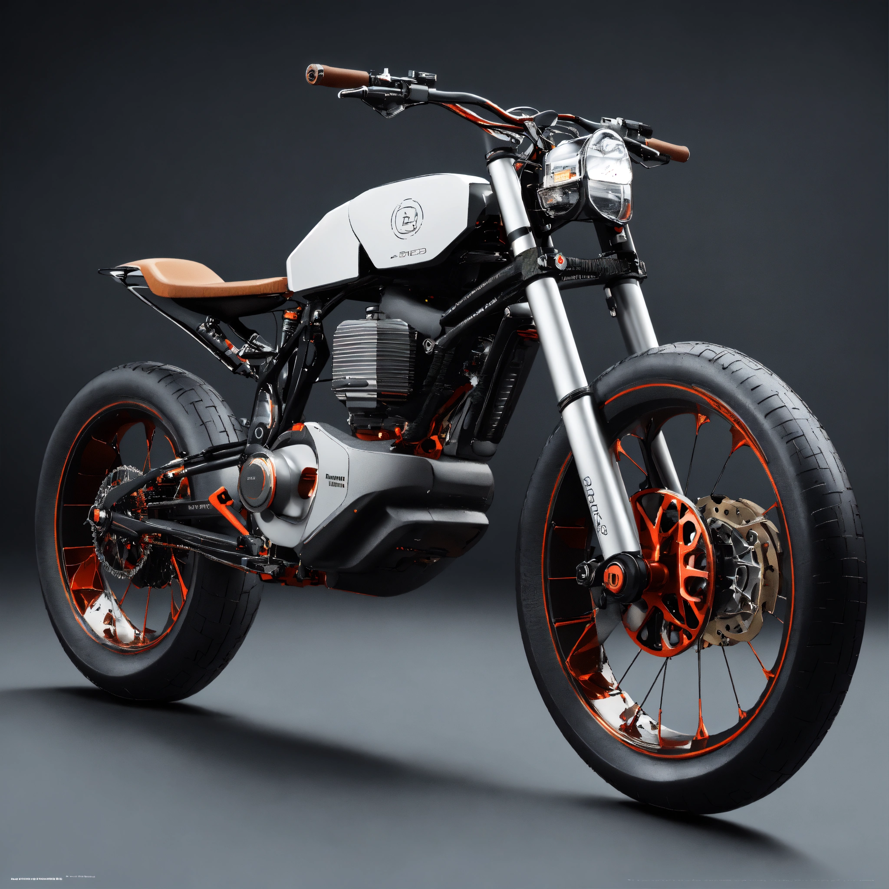
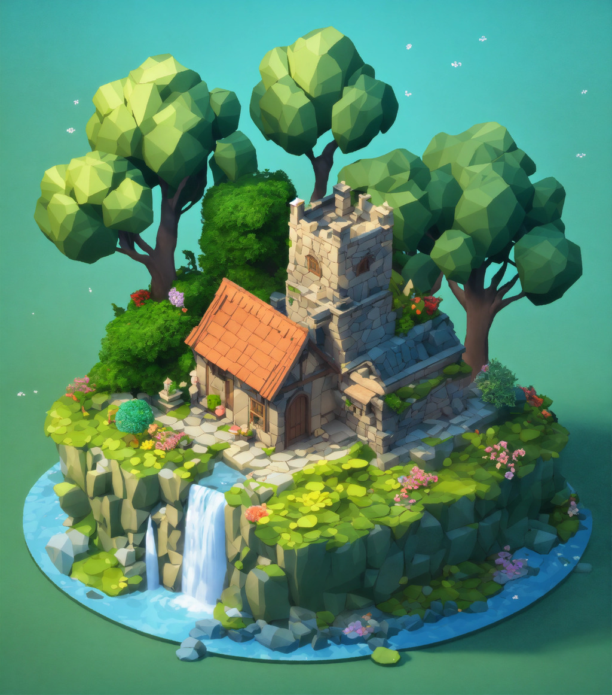

# sources

the images are collected from internet, often generated from T2I models.
I'll try to keep track of the exact references here, as of now, they mostly come from :

# [civit.ai](https://civitai.com/)

* old man

* fox

* mech

* castle (???)

# [lexica](https://lexica.art/)

* bob 

* moto 

* diorama 

### tests (used locally):

hamster https://civitai.com/images/50845478)

scifi https://lexica.art/prompt/c48df098-ce5d-4198-98e0-2e0f2385d6f8

boy https://lexica.art/prompt/ca4fa23b-a69f-41c5-809f-619bd684c6cb

watercolour-castle https://lexica.art/prompt/9196aa95-71e0-44a0-9656-51b868f795f7

girl https://civitai.com/images/50855669

robot1 https://civitai.com/images/49923041
